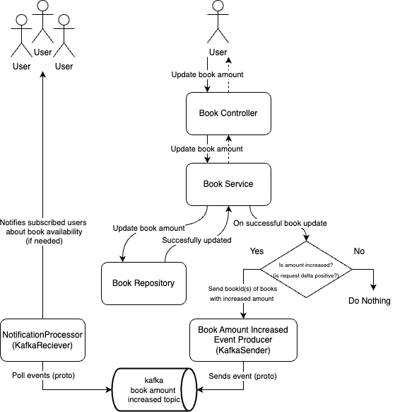

# Book Exchange Service

             .--.           .---.        .-.
         .---|--|   .-.     | A |  .---. |~|    .--.
      .--|===|Ch|---|_|--.__| S |--|:::| |~|-==-|==|---.
      |%%|NT2|oc|===| |~~|%%| C |--|   |_|~|CATS|  |___|-.
      |  |   |ah|===| |==|  | I |  |:::|=| |    |GB|---|=|
      |  |   |ol|   |_|__|  | I |__|   | | |    |  |___| |
      |~~|===|--|===|~|~~|%%|~~~|--|:::|=|~|----|==|---|=|
      ^--^---'--^---^-^--^--^---'--^---^-^-^-==-^--^---^-'

Book Exchange Service is an application that allows people to exchange books with each other. Users can search for books that interest them and propose books they no longer need for exchange. The service provides functionalities to create, update, and delete book records, manage user information, and track book wishlists.

## Features

- **Create, update, and delete books**: Add new books, update existing ones, and delete them when no longer available.
- **Manage users**: Create, update, and delete users in the system.
- **Wishlists**: Users can maintain wishlists of books they are interested in, allowing them to track books for potential exchanges.
- **Search and Propose Books**: Users can search for books and propose books for exchange.

## Kafka Diagram



## Book Endpoints

### 1. Create a Book

- **Method**: `POST /book/`
- **Description**: Adds a new book to the system.
- **Request Body**: `CreateBookRequest`
  ```json
  {
    "title": "string",
    "author": "string",
    "description": "string",
    "amountAvailable": 1
  }
  ```
- **Response**: `201 Created`  
  Returns the created book in `ResponseBookDto`.

### 2. Get Book by ID

- **Method**: `GET /book/{id}`
- **Description**: Retrieves a book by its ID.
- **Response**:  
  Returns the book in `ResponseBookDto`.

### 3. Update a Book

- **Method**: `PUT /book/`
- **Description**: Updates an existing book.
- **Request Body**: `UpdateBookRequest`
  ```json
  {
    "id": "string",
    "title": "string",
    "author": "string",
    "description": "string",
    "amountAvailable": 1
  }
  ```
- **Response**:  
  Returns the updated book in `ResponseBookDto`.

### 4. Update Book Amount

- **Method**: `PATCH /book/{id}/amount`
- **Description**: Updates the available amount of a book.
- **Request Body**: `UpdateAmountRequest`
  ```json
  {
    "delta": 1
  }
  ```
- **Response**:  
  Returns the updated amount as an integer.

### 5. Delete a Book

- **Method**: `DELETE /book/{id}`
- **Description**: Deletes a book from the system.
- **Response**: `204 No Content`

## User Endpoints

### 1. Create a User

- **Method**: `POST /user/`
- **Description**: Creates a new user.
- **Request Body**: `CreateUserRequest`
  ```json
  {
    "name": "string",
    "email": "string"
  }
  ```
- **Response**: `201 Created`  
  Returns the created user in `ResponseUserDto`.

### 2. Get User by ID

- **Method**: `GET /user/{id}`
- **Description**: Retrieves a user by their ID.
- **Response**:  
  Returns the user in `ResponseUserDto`.

### 3. Update a User

- **Method**: `PUT /user/`
- **Description**: Updates an existing user.
- **Request Body**: `UpdateUserRequest`
  ```json
  {
    "id": "string",
    "name": "string",
    "email": "string"
  }
  ```
- **Response**:  
  Returns the updated user in `ResponseUserDto`.

### 4. Add Book to User's Wishlist

- **Method**: `PATCH /user/{id}/wishlist`
- **Description**: Adds a book to the user's wishlist.
- **Request Params**:  
  - `bookId`: The ID of the book to add to the wishlist.
- **Response**:  
  Returns the updated user in `ResponseUserDto`.

### 5. Delete a User

- **Method**: `DELETE /user/{id}`
- **Description**: Deletes a user from the system.
- **Response**: `204 No Content`
